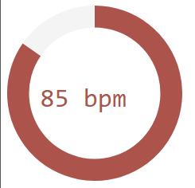

This is a simple replacement for the terrible Overwolf overlay that comes with the Mionix QG. Javascript embedded in an html doc listens to a websocket and displays the results in an arc graph...thing. (Using d3)

An example by [tyrope](https://gist.github.com/tyrope/c7cd3ec73e76bef9705d101c110b18e2) is used for the websocket side, and [this](http://ramblings.mcpher.com/Home/excelquirks/bigapps/bigquiz/dashtimer) is used (with modifications) for the display portion.

When functioning properly this is how it looks:

To use it in OBS first clone this repository locally. Then create a new browser source in OBS and point it at overlay.html in the cloned repository folder. You can resize the browser in OBS, but changing an item to something other than it's native resolution is an expensize operation. Probably not the best idea though. Instead to change it's size go into overlay.html and change the width and height values. In the svg section:

    <svg width="175" height="175"></svg>
    
Then save the file and refresh the OBS browser. Adjust the BrowserSource width, and height to match what you set in overlay.html.

Or just use a transform. I don't care. I'm not your mom.
